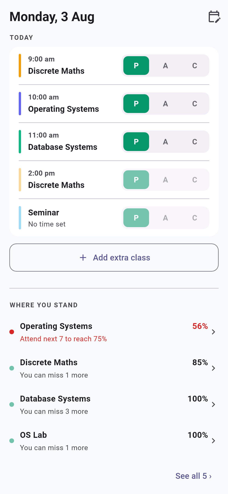
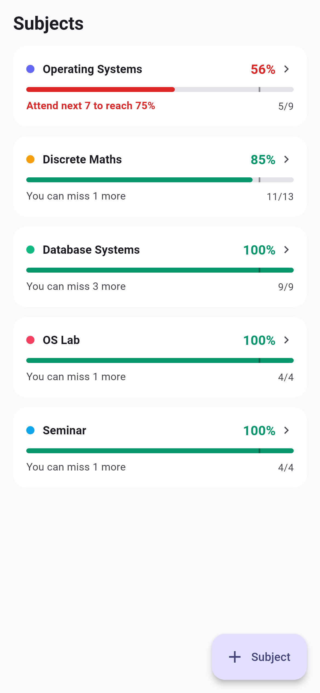
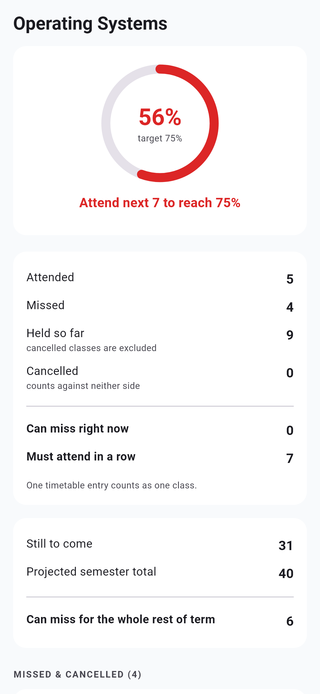
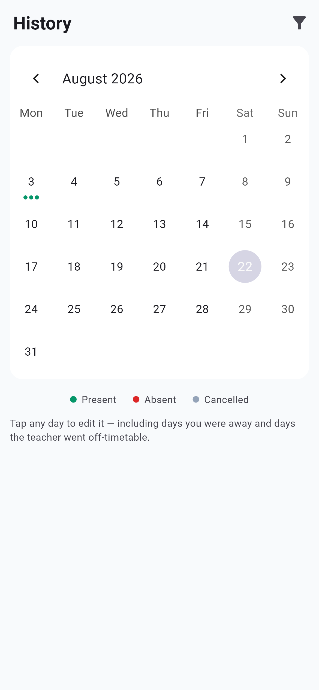
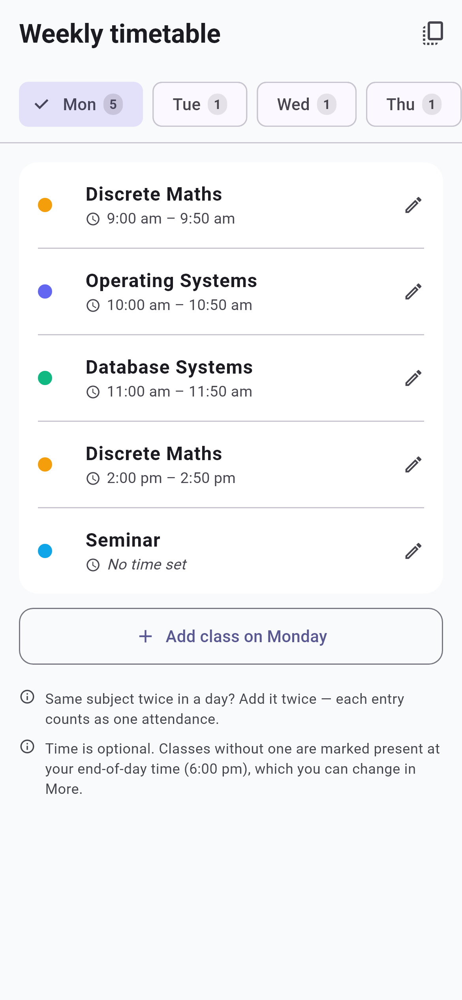

<div align="center">


# ProxyMate

**An attendance tracker that assumes you went to class.**

Every class on your timetable is marked present the moment it ends.
You open the app only when you *skipped* one.

[](https://github.com/aryanjsawant/ProxyMate---University-Attendance-Marker/releases/latest)


</div>

---

<div align="center">

| Home | Subjects | Detail |
|:---:|:---:|:---:|
|  |  |  |
| Today's classes and where you stand | One card, one answer per subject | The full arithmetic |

| History | Timetable |
|:---:|:---:|
|  |  |
| Every day, fully editable | Subject + day + optional time |

</div>

---

## Install

**[⬇ Download the latest APK](https://github.com/aryanjsawant/ProxyMate---University-Attendance-Marker/releases/latest)** — grab the file ending in **`-arm64.apk`**; that's right for essentially every phone made since 2017.

1. Open the downloaded file on your phone.
2. Android will say the source isn't allowed → **Allow from this source**.
3. **Install**. If a "harmful app" screen appears, tap **More details → Install anyway**.

<details>
<summary>Why does Android warn about it?</summary>

<br>

Two separate prompts, neither meaning anything is wrong:

- **"Install unknown apps"** is Android's sideloading permission, required for *any* app not installed from a store.
- **Play Protect's "unsafe app"** appears because Google has never scanned this app. Signing with a proper release key does **not** remove it — Play Protect warns about unrecognised apps regardless of which key signed them. Only distribution through Play does.

`adb install proxymate-*-arm64.apk` over USB skips both prompts.

</details>

---

## Why

Four things every other attendance app gets wrong:

|  | ProxyMate |
|---|---|
| **Can't track two classes of one subject in a day** | Each timetable entry is independent. Add the subject twice; mark them separately. |
| **You must open the app and tap "present" for every class** | Inverted. Presence is assumed; absence is the exception you record. |
| **No notifications** | An end-of-day confirmation, plus an alert the instant an absence drops you below target. |
| **No timetable intake** | Enter it once; every record generates from it. |

Plus the one nobody handles: **teachers ignore the timetable.** Extra classes, cancellations and retroactive corrections are all first-class, not workarounds.

## What you get

- **Zero taps for a perfect week.** Attend everything and you never open the app.
- **One tap when you bunk.** `P` `A` `C` on every row, with `P` preselected.
- **The number you actually want** — *"You can miss 3 more"*, or *"Attend next 4 to reach 75%"*.
- **Set it up mid-semester.** Everything from your start date to today is filled in the moment you finish setup.
- **Fully editable history.** Extra classes, cancelled classes, whole days off, date ranges.
- **Per-subject targets**, because not every college wants 75%.
- **Completely offline.** No account, no server — the release build declares **no internet permission at all**.

---

## How it works

### Presence is the assumption

There is no background service. Android OEMs kill background work aggressively, and silently-wrong attendance is the exact failure this app exists to prevent. Instead **`catchUp()` runs every time you open the app**:

1. Walk each date from `max(term start, last generated)` to today.
2. Skip holidays and anything past the term end.
3. For each class whose end time has **already passed**, if no record exists, insert `present`.

Two invariants carry the whole design:

- **Manual always wins.** Generation only ever *inserts where nothing exists*. It never updates or overwrites, so a correction is permanent.
- **Never mark a class that hasn't happened.** Only elapsed classes materialise.

So not opening the app for a week is correct by construction: reopening backfills every elapsed class as present — exactly what you meant by not opening it.

### The model

```
Subject   name, colour, optional teacher/room, target %   ← the unit of accounting
Slot      subject + weekday + OPTIONAL start/end time     ← one weekly entry
Record    what actually happened: status, manual?, note
Term      start, optional end, target %, holidays
```

- **A lab is just another subject.** No course/component nesting. Colleges enforce a separate percentage per registration line, and nesting invites pooling them — which is what lets a healthy lecture percentage hide a failing lab.
- **One timetable entry is one attendance.** A two-hour class counts once. A subject meeting twice on a Tuesday is two entries. Hence no period grid and no unit multiplier.
- **Time is optional.** Entries without one are marked present at your **end of day** (default 6 pm, changeable). They sort after timed classes.
- **Records are materialised, not derived.** Editing your timetable in week 8 must not rewrite weeks 1–7.

### The maths

Per subject. `a` = attended, `h` = held (`present + absent`; **cancelled counts against neither side**), `p` = target, `R` = classes remaining.

| Output | Formula |
|---|---|
| Current % | `a / h` |
| Can miss right now | `floor(a/p) − h` |
| Must attend consecutively to recover | `ceil((p·h − a) / (1 − p))` |
| Can miss across the rest of term | `floor(a + R − p·(h + R))` |
| Best achievable % | `(a + R) / (h + R)` |

If the target becomes unreachable the app says so outright — *"75% not reachable — best case 68%"* — rather than showing a cheerful impossible number.

### Notifications

Local only; scheduled by Android's `AlarmManager`, not sent from anywhere.

| When | What |
|---|---|
| After your last class | *"Marked you present for 5 classes. Miss any?"* — the safety net that makes assuming-present trustworthy. |
| The instant you drop below target | *"Operating Systems dropped below 75%"* |
| Sunday evening | Weekly summary |

Attendance correctness never depends on these firing.

---

## Build it yourself

```bash
flutter pub get
flutter test --exclude-tags screenshots   # 83 tests
flutter analyze
flutter run                               # phone on USB debugging

flutter build apk --release --split-per-abi
```

Regenerate the screenshots above with:

```bash
flutter test --update-goldens --tags screenshots
```

### Publishing a release

Tag it and CI does the rest — [`.github/workflows/release.yml`](.github/workflows/release.yml) builds the APKs on GitHub's runners and attaches them to a Release, so binaries never enter the repo:

```bash
git tag v1.0.0
git push origin v1.0.0
```

<details>
<summary>Toolchain notes</summary>

<br>

Gradle 8.14.3, AGP 8.11.0, Kotlin 2.1.20 — pinned because the machine this was developed on cannot reach `services.gradle.org`, Maven Central or the Gradle Plugin Portal. They resolve normally on any unrestricted network and can be raised freely.

The NDK version can be overridden per-machine by adding `ndk.version=…` to `android/local.properties` (gitignored); without it the Flutter default is used. That exists because one machine has a corrupt NDK install, and it must reach plugin subprojects too — `path_provider_android` pulls in `jni`, which has native code.

Release builds are signed with the debug key. Fine for sideloading, and *not* what triggers the Play Protect warning; but the debug keystore is per-machine, so an APK built elsewhere can't upgrade in place.

</details>

---

## Project layout

```
lib/
  models/      Subject, Slot, Record, Term, AppState
  logic/       schedule · stats · attendance · notifications   ← no Flutter imports
  state/       Riverpod providers
  screens/     home · subjects · history · settings · editors
  widgets/     the P/A/C toggle, class rows, standings
test/          83 tests + the screenshot generator
docs/          screenshots
```

`logic/` is pure Dart with no UI dependencies, which is why the maths can be tested exhaustively without a device — and why an iOS port would be mostly mechanical.

## Tests

| File | Covers |
|---|---|
| `stats_test.dart` | Every formula and boundary: exactly at target, zero held, unreachable target, 100%-with-no-slack, and the floating-point cases where a bare `floor()` costs you a class |
| `attendance_test.dart` | Manual never overwritten, unelapsed classes not materialised, marked-to-the-minute, week-long gap backfill, holidays, idempotence |
| `schedule_test.dart` | Expansion, timed vs untimed ordering, when each kind of class counts as over |
| `subject_lifecycle_test.dart` | Add/rename/delete cascades, orphaned slots, `copyDay`, same-time collisions, save-file round-trips |
| `ui_test.dart` | Real widgets: tapping A records an absence, Undo restores it, empty states appear |

## Known gaps

- Import lives in Settings, reachable only after setup, so a backup can't be restored on a clean install.
- No iOS build. The engine is portable; iOS needs a Mac, and free-provisioning sideloads expire after 7 days.
- Deleting a subject deletes its attendance history. The confirm dialog names exactly what goes, but there's no undo.

## Publishing

`docs/PUBLISHING.md` is the full Play Store checklist — signing key, app bundle, store listing copy, data-safety answers, and the closed-test requirement that gates production access.

Store assets are generated, not hand-exported, so they can't drift from the app:

```bash
dart run tool/make_icon.dart            # launcher icon
dart run tool/make_store_graphics.dart  # 512px listing icon + feature graphic
flutter test --update-goldens --tags screenshots
```

Release signing reads `android/key.properties` (gitignored). Without it, release builds fall back to the debug key so a fresh clone can still build a sideloadable APK — Play rejects those, so an upload build simply requires the file to exist. Verify which key was used:

```bash
apksigner verify --print-certs build/app/outputs/flutter-apk/app-release.apk
```

---

## Branches

- **`master`** — the general app, for any college.
- **`svnit`** — a fork with the SVNIT M.Tech AI timetable, elective pairs and lab batches baked in as seed data.

<div align="center">
<br>
<sub>MIT licensed · built with Flutter · no accounts, no servers, no tracking</sub>
</div>
